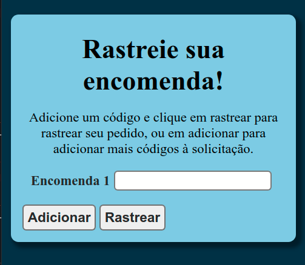

# rastreador-encomenda-correios

#### Importante:
Esta aplicação pode não funcionar corretamente devido à mudanças feitas no sistema dos correios, o que criou algumas incompabilidades com a biblioteca utilizada para pegar as informações dos pacotes. Para mais informações sobre o estado da biblioteca, dê uma olhada no repositório dela [clicando aqui](https://github.com/talesluna/rastrojs).

## O que é este projeto?
Este é um projeto de uma aplicação que roda em um servidor local e permite saber a última localização encontrada das suas encomendas transportadas pelo correio, sendo que você pode fazer o rastreio de um ou mais códigos dos correios por vez.

## Como este projeto está estruturado?
O projeto está dividido em duas partes: o backend e o frontend. 

O backend é composto apenas pelo arquivo *server.js*, onde um servidor node com express roda na porta 3000 do localhost, servindo para este endereço os arquivos estáticos presentes na pasta front.

Na pasta front, existem os arquivos *index.html* que é implementado com a utilização de uma Vue instance e o arquivo *style.css* que é responsável pela formatação da interface.

## Como este projeto funciona?
Na tela inicial, dois eventos são monitorados pela instância do Vue que são os cliques nos botões *Adicionar* e *Rastrear*. No botão *Adicionar* um novo campo de input que permite a inserção de um novo código de rastreio é adicionado, e no botão de *Rastrear* todos os códigos inseridos são enviados para o backend onde as informações relevantes para essa aplicação são extraídas a partir da biblioteca [rastrojs](https://github.com/talesluna/rastrojs), que realiza o rastreio das encomendas.

Após isso, as informações referentes aos códigos de rastreio são passadas novamente para o frontend (que eu só consegui fazer com a ajuda do [Fuskinha](https://github.com/pedrohenriquelacombe)), onde ocorre a troca de conteúdo da página para mostrar os resultados obtidos através da renderização condicional, que exibe o último destino de todos os pacotes, ou uma mensagem indicando que o código passado está incorreto. Nessa segunda página existe um botão para retornar para a primeira página e realizar mais rastreios.

## Como utilizar este projeto
Para que o código funcione na sua máquina, é preciso que você tenha o node instalado no seu computador, depois disso, é preciso fazer o download do repositório clonando-o ou utilizando o comando `git clone https://github.com/LelePG/rastreador-encomenda-correios`. Uma vez dentro da pasta da aplicação é preciso abrir o terminal e rodar o comando `npm i` para instalar as dependências do projeto, e então o comando `npm start` para dar início à aplicação. 

Uma mensagem vai aparecer no console, indicando o endereço para que você possa acessar a aplicação no browser, e então é só inserir os códigos e fazer o rastreio.

## Bônus: rastreio por linha de comando
Foi implementada também uma maneira de rastrear suas encomendas por meio de linha de comando, para isto basta abrir o terminal, instalar as dependências com `npm i` e então usar o comando `npm run cli` para fazer o rastreio das encomendas. Os códigos que serão rastreados são colocados no arquivo **encomendas.txt** que se encontra na pasta cli. Para que a aplicação funcione, basta modificar este arquivo substituindo seu conteúdo pelos códigos que você quer rastrear. 
## Links úteis
- [Biblioteca de rastreio de encomendas dos correios de Tales Luna](https://github.com/talesluna/rastrojs)
- [Paleta de cores utilizada no projeto](https://coolors.co/8ecae6-219ebc-023047-ffb703-fb8500)
- [Canal da Twitch do Fuskinha](https://www.twitch.tv/fuskinha)
